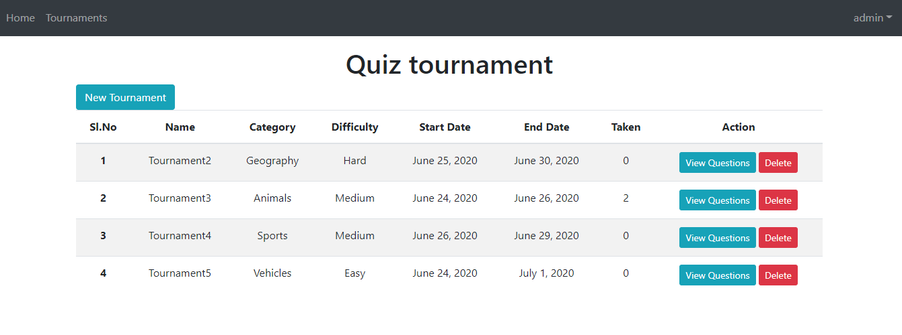

# Project Documentation

This project aimed at creating several quiz tournaments. Users can check tournaments that are ongoing, upcoming, previously participated and missed. When a user participates in a tournament, 10 questions are dynamically fetched from OpenTDB API.  The system was designed to handle user-specific and admin-specific activities.

## Admin screens

## User screens

